# z-idx

z-index の DAG 化で宣言的な重なり順を安定した数値レイヤーへ変換し複数 UI ライブラリで共有します。

## Contents

<table>
<tr valign="top">
<td nowrap>

1. [Getting Started](#getting-started)
      1. [Installation](#installation)
      2. [Example](#example)
      3. [Purpose](#purpose)
2. [Rationale](#rationale)
      1. [Core Concepts](#core-concepts)
      2. [Type Inference](#type-inference)
      3. [API Surface](#api-surface)

</td>
<td nowrap>

3. [Pair Catalogue](#pair-catalogue)
      1. [Pair Basics](#pair-basics)
      2. [Pair Recursion](#pair-recursion)
      3. [Pair Inference](#pair-inference)
4. [Topology Atlas](#topology-atlas)
      1. [Three Nodes](#three-nodes)
      2. [Four Nodes](#four-nodes)
      3. [Five Nodes](#five-nodes)

</td>
<td nowrap>

5. [Extensions](#extensions)
      1. [Extension Stability](#extension-stability)
      2. [Extension Density](#extension-density)
      3. [Extension Packing](#extension-packing)
6. [Appendix](#appendix)
      1. [Design Notes](#design-notes)
      2. [Contributing](#contributing)
      3. [License](#license)

</td>
</tr>
</table>

## Getting Started

### Installation

```
npm i z-idx
```

### Example

<!-- prettier-ignore -->
```tsx
const base = index((z) => [
    z('menu bar', 'primary overlay', 'primary menu'),
    z('primary overlay', 'Github')
])

const next = base((z) => [
    z('secondary overlay', 'primary menu', 'secondary menu'),
])

if (base.Github !== next.Github) throw Error()

render(<MenuPlayground next={next} />)
```

### Purpose

z-idx は宣言的な部分順序の z 関係を、拡張しても揺らがない数値スタック順位に変換する
直列チェーン、親 → 子ツリー、入れ子の pairs を受け取り、すべてのキー名を TypeScript 推論に持ち上げることで、
下流のパッケージでも override 後に同一の数値を共有できる。

## Rationale

### Core Concepts

z-idx はヘルパー z を受け取る。`z('a','b','c')` のように複数文字列を渡すと一様ステップの順序対 `a<b<c` を生成する。
`z('a',['b','c','d'])` のように親と配列を渡すと親を各子の下に結びつけ、兄弟間の間隔も一定に保つ。
入れ子配列や既存の TaggedPairs を埋め込めるので、順序を失わずに木状の DAG を記述できる。
ランクは広い STEP (`1<<10`) から始め、後続の挿入でシードを動かさずに隙間を二分できる。
最初のトポロジーカルパス（Kahn）がサイクルを拒否し、二度目のパスで各ノードの上下界を計算し、
シードのフェンスに合わせて中央値を選び、狭い間隔は warns に残す。

### Type Inference

z-idx の戻り値は呼び出し可能かつマップ的なオブジェクト。build 中に現れたすべてのキーが返り値の型に捕捉され、
エディタはプロパティ補完（`base.a`, `base.b`）や拡張時の既存キー提示（`base((z)=>[z('b','x','c')])`）を行える。
TaggedPairs は配列内に入っても埋め込まれたキー集合を保持するため、深く合成したツリーでも補完がすべて露出する。

### API Surface

```ts
(build: (z: ZPair) => P): ZApi<Keys<P>>
```

`ZPair` は二つの形を持つ。直列形: `z(lower, mid, upper, ...)` が連続関係を作る。
ツリー形: `z(parent, childrenArray)` で、childrenArray は文字列・入れ子配列・TaggedPairs を含められ、
兄弟は同一ステップと宣言順を維持する。
返る `ZApi` は拡張呼び出しができ、数値ランクと `warns` 配列も公開する。

## Pair Catalogue

### Pair Basics

直列チェーンで決定的ステップ: `z('a','b','c','d')` は一定間隔で昇順に並ぶ。
親配列の平坦化: `z('a',['b','c','d'])` は `a` を各子の下に置き、兄弟を均等に配置。
チェーンとサブツリーを混在させても一様ステップを維持（`z('a','b','c'), z('b',['d','e'])`）。
深い入れ子配列も親の一段上に畳まれ、兄弟間隔を保持。
合成推論により `{a,b,c,d,e}` すべてが数値型として露出。

### Pair Recursion

TaggedPairs は子として再利用できる。
`const chain = z('b','c','d'); z('a',[chain,'e'])` で `a` をチェーン根の下に結び、`e->c->d` まで等間隔が続く。
複数の tagged サブツリーが同じ親を持っても等間隔（`a` の上に `b<c<d<e`）。
トップレベルのチェーンと兄弟配列を混ぜても一つのステップで枝分かれ（`a<b<d<e<c<f<g`）。
直列・配列・tagged 入力すべてをまたいで推論し、返り値が全ノードを露出する。

### Pair Inference

入れ子の tagged サブツリーもステップを失わず再帰: `z('a',[z('b',[z('c','d'),'e']), z('f',['g'])])` は `a<b<f<c<e<g<d` の単調ランクと同一間隔を得る。
`z('a',[[['b','c']],['d','e'],'f'])` のような深く包んだ兄弟配列でも等間隔。
チェーンとツリーを組み合わせた拡張ではシードを動かさずに間へ新規ノードを置き、
新キーは下限より大きく上限より小さい位置を保つ。
さらに `z('a',['b','c']), z('b',[z('d',['e',z('f','g')]),'h'])` のような合成でも 8 つのキーが順序付きで API に現れる。

## Topology Atlas

### Three Nodes

3 頂点の非同型 DAG 6 形すべてを表現。
直線 `a<b<c` は整列を維持。
単一親の兄弟配列 `a<[b,c]` は並び替え時も子順を保持。
二つの根が一つのシンクへ（`a->c, b->c`）滑らかに収束。
完全密な三角形（`a->b, a->c, b->c`）は推移律を守る。
`z('a',[z('b','c')])` のような入れ子ペア配列も同じ順序に畳まれる。
後から届く祖先ペアでも正準のトポロジー順になる。

<table>
<tr valign="bottom">
<td nowrap>

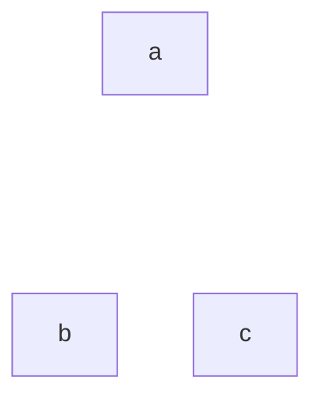

```ts
z(['a', 'b', 'c'])
```

</td>
<td nowrap>

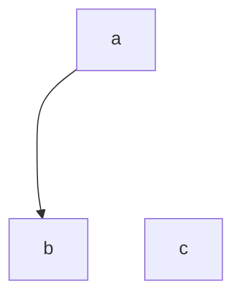

```ts
z('a', 'b')
```

</td>
<td nowrap>

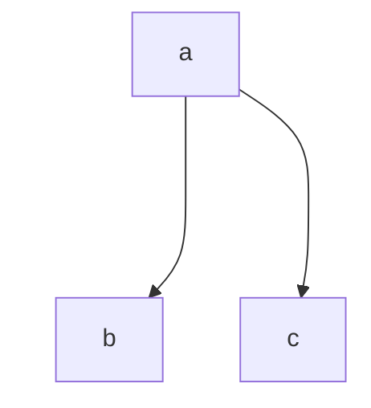

```ts
z('a', ['b', 'c'])
```

</td>
<td nowrap>

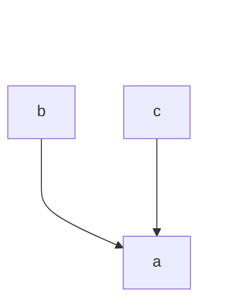

```ts
z(['b', 'c'], 'a')
```

</td>
<td nowrap>

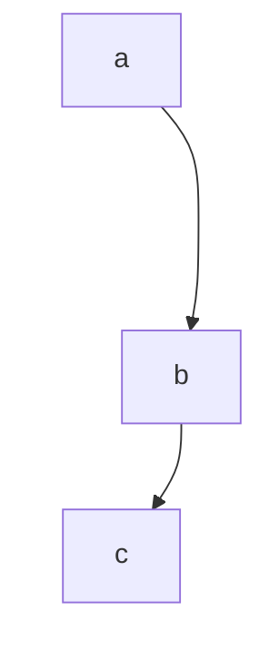

```ts
z('a', 'b', 'c')
```

</td>
<td nowrap>

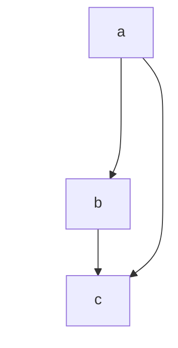

```ts
z('a', 'b', 'c'), z('a', 'c')
```

</td>
</tr>
</table>

### Four Nodes

4 頂点の DAG 一覧（31 形）は、チェーン、ファン、ダイヤ、はしご、マージした根を組み合わせて表現可能。
ダイヤ `a->b, a->c, b->d, c->d`、平衡フォーク `a->[b,c,d]`、
兄弟順逆転 `a->[d,c,b]`、筋交いはしご `a->b, a->c, b->c, c->d`、
尾を持つ並列根、シンク前に合流する二つの根などを含む。
辺の密度に依存せず一様ギャップが続き、全同型分類で決定的な間隔を示す。

#### 6 edges

<table>
<tr valign="bottom"><td nowrap>

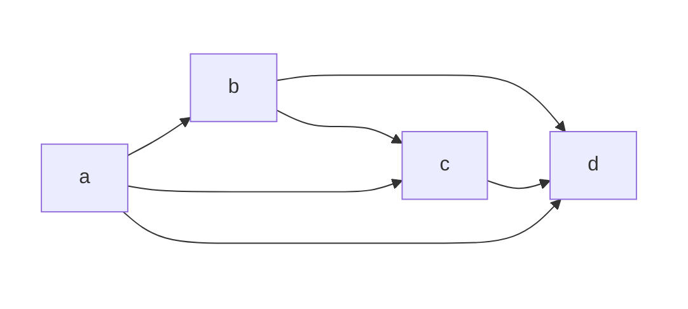

```ts
z('a', ['b', 'c', 'd']), z('b', ['c', 'd']), z('c', 'd')
```

</td>
</tr>
</table>

#### 5 edges

<table>
<tr valign="bottom">
<td nowrap>

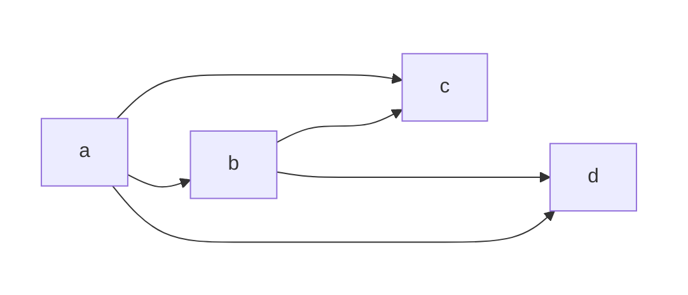

```ts
z('a', ['b', 'c', 'd']), z('b', ['c', 'd'])
```

</td>
<td nowrap>

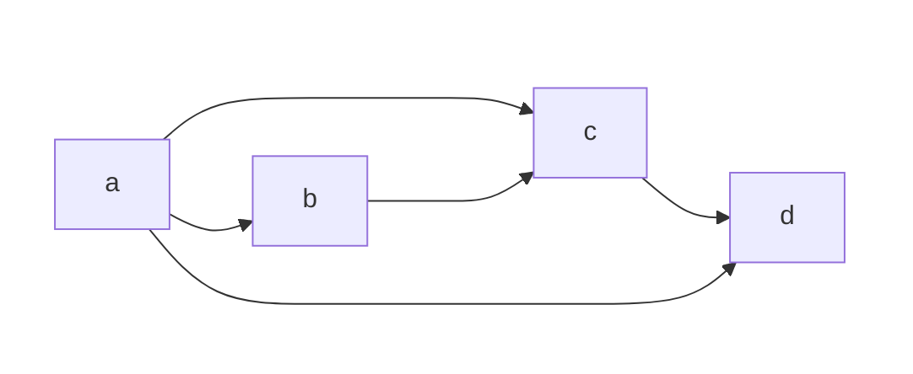

```ts
z('a', ['b', 'c', 'd']), z('b', 'c', 'd')
```

</td>
<td nowrap>

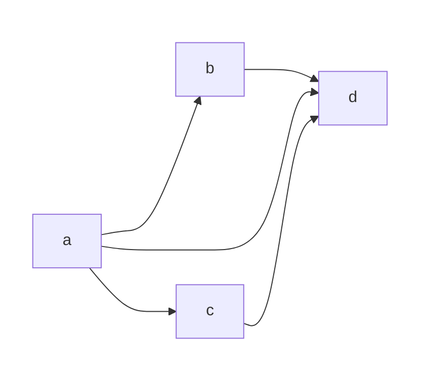

```ts
z('a', ['b', 'c', 'd']), z(['b', 'c'], 'd')
```

</td>
<td nowrap>

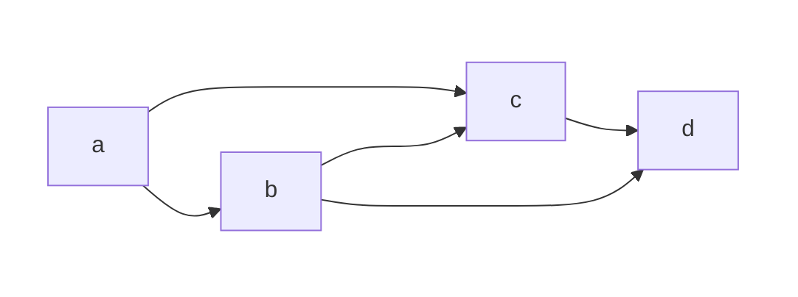

```ts
z('a', 'b', ['c', 'd']), z('a', 'c', 'd')
```

</td>
<td nowrap>

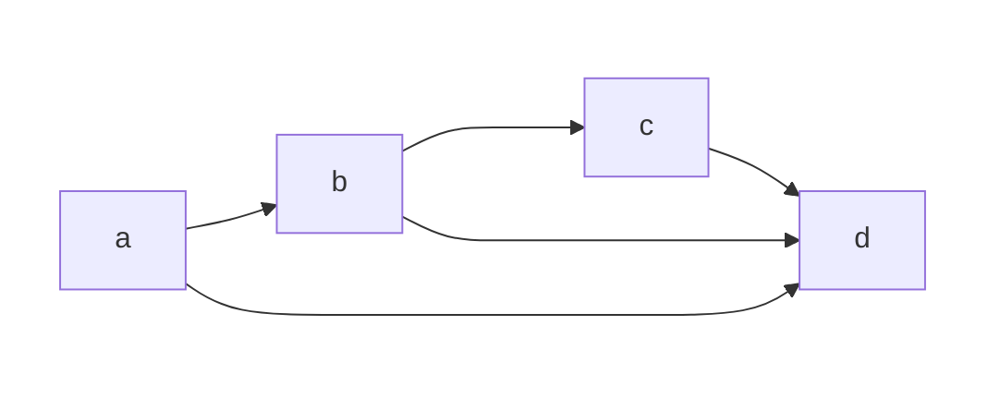

```ts
z('a', 'b', ['c', 'd']), z(['a', 'c'], 'd')
```

</td>
<td nowrap>

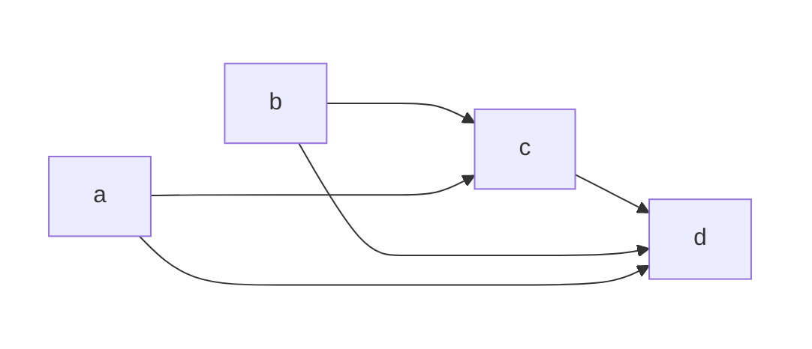

```ts
z('a', ['c', 'd']), z('b', ['c', 'd']), z('c', 'd')
```

</td>
</tr>
</table>

#### 4 edges

<table>
<tr valign="bottom">
<td nowrap>

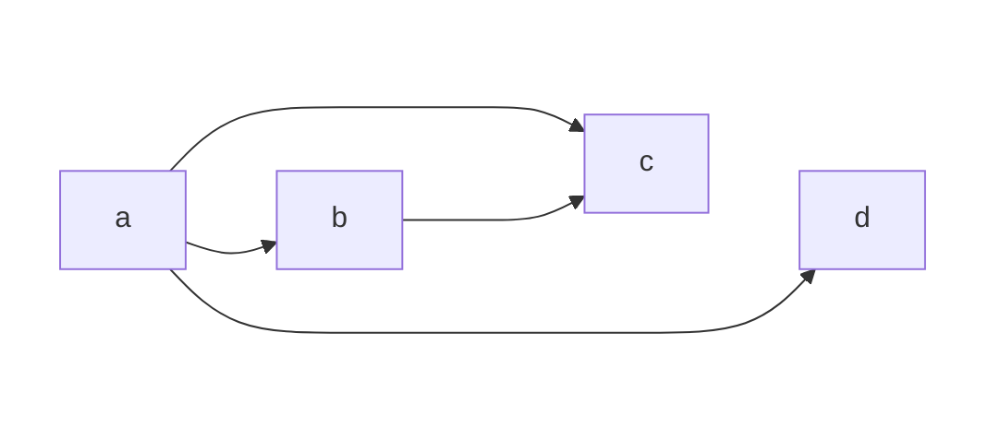

```ts
z('a', ['b', 'c', 'd']), z('b', 'c')
```

</td>
<td nowrap>

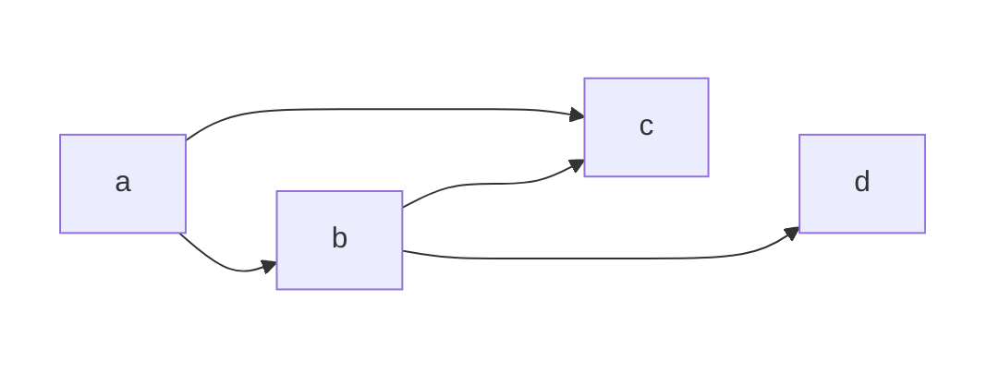

```ts
z('a', ['b', 'c']), z('b', ['c', 'd'])
```

</td>
<td nowrap>

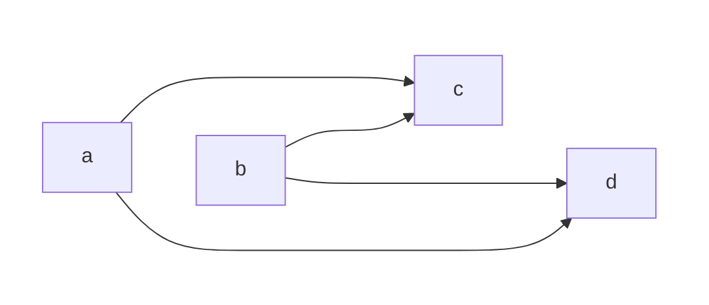

```ts
z('a', ['c', 'd']), z('b', ['c', 'd'])
```

</td>
<td nowrap>

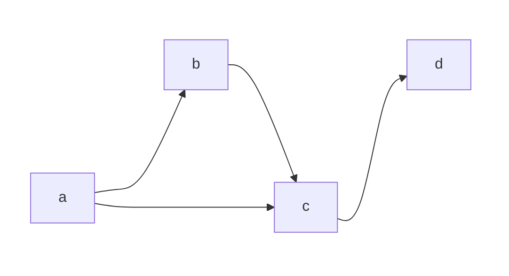

```ts
z('a', ['b', 'c']), z('b', 'c', 'd')
```

</td>
<td nowrap>

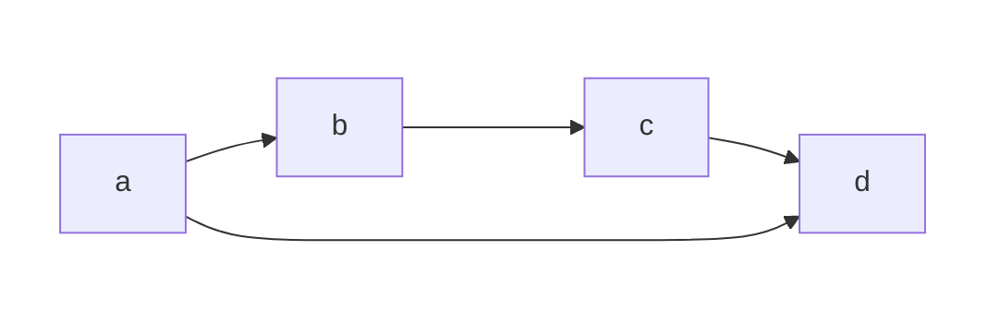

```ts
z('a', ['b', 'd']), z('b', 'c', 'd')
```

</td>
<td nowrap>

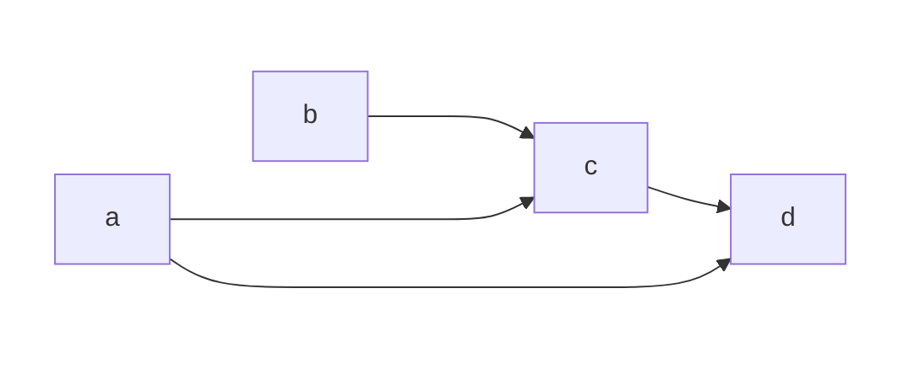

```ts
z('a', ['c', 'd']), z('b', 'c', 'd')
```

</td>
<td nowrap>

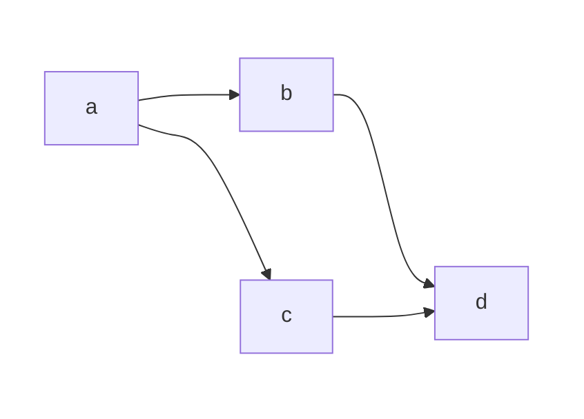

```ts
z('a', ['b', 'c']), z(['b', 'c'], 'd')
```

</td>
<td nowrap>

```mermaid
flowchart LR
    subgraph x[" "]
        direction TB
        a
        b
    end
    subgraph y[" "]
        direction TB
        c
        d
    end
    a ~~~ b
    style x fill:none,stroke:none
    style y fill:none,stroke:none
    a --> c
    a --> d
    b --> d
    c --> d

```

```ts
z('a', ['c', 'd']), z(['b', 'c'], 'd')
```

</td>
<td nowrap>

```mermaid
flowchart LR
    subgraph x[" "]
        direction TB
        a
        b
    end
    subgraph y[" "]
        direction TB
        c
        d
    end
    a ~~~ b
    c ~~~ d
    style x fill:none,stroke:none
    style y fill:none,stroke:none
    a --> b
    b --> c
    b --> d
    c --> d
```

```ts
z('a', 'b', 'c', 'd'), z('b', 'd')
```

</td>
</tr>
</table>

#### 3 edges

<table>
<tr valign="bottom">
<td nowrap>

```mermaid
flowchart LR
    subgraph x[" "]
        direction TB
        a
        c
    end
    subgraph y[" "]
        direction TB
        b
        d
    end
    a ~~~ b
    c ~~~ d
    style x fill:none,stroke:none
    style y fill:none,stroke:none
    a --> b
    a --> c
    a --> d

```

```ts
z('a', ['b', 'c', 'd'])
```

</td>
<td nowrap>

```mermaid
flowchart LR
    subgraph x[" "]
        direction TB
        a
        b
    end
    subgraph y[" "]
        direction TB
        c
        d
    end
    a ~~~ b
    c ~~~ d
    style x fill:none,stroke:none
    style y fill:none,stroke:none
    a --> b
    a --> c
    b --> c

```

```ts
z('a', ['b', 'c']), z('b', 'c')
```

</td>
<td nowrap>

```mermaid
flowchart LR
    subgraph x[" "]
        direction TB
        a
        b
    end
    subgraph y[" "]
        direction TB
        c
        d
    end
    a ~~~ b
    c ~~~ d
    style x fill:none,stroke:none
    style y fill:none,stroke:none
    a --> c
    a --> d
    b --> c

```

```ts
z('a', ['c', 'd']), z('b', 'c')
```

</td>
<td nowrap>

```mermaid
flowchart LR
    subgraph x[" "]
        direction TB
        a
        b
    end
    subgraph y[" "]
        direction TB
        c
        d
    end
    a ~~~ b
    c ~~~ d
    style x fill:none,stroke:none
    style y fill:none,stroke:none
    a --> b
    b --> c
    b --> d

```

```ts
z('a', 'b'), z('b', ['c', 'd'])
```

</td>
<td nowrap>

```mermaid
flowchart LR
    subgraph x[" "]
        direction TB
        a
        b
    end
    subgraph y[" "]
        direction TB
        c
        d
    end
    a ~~~ b
    c ~~~ d
    style x fill:none,stroke:none
    style y fill:none,stroke:none
    a --> b
    b --> c
    c --> d

```

```ts
z('a', 'b', 'c', 'd')
```

</td>
<td nowrap>

```mermaid
flowchart LR
    subgraph x[" "]
        direction TB
        a
        c
    end
    subgraph y[" "]
        direction TB
        b
        d
    end
    a ~~~ b
    c ~~~ d
    style x fill:none,stroke:none
    style y fill:none,stroke:none
    a --> c
    b --> c
    c --> d

```

```ts
z(['a', 'b'], 'c', 'd')
```

</td>
<td nowrap>

```mermaid
flowchart LR
    subgraph x[" "]
        direction TB
        a
        b
    end
    subgraph y[" "]
        direction TB
        c
        d
    end
    a ~~~ b
    c ~~~ d
    style x fill:none,stroke:none
    style y fill:none,stroke:none
    a --> d
    b --> c
    c --> d

```

```ts
z('a', 'd'), z('b', 'c', 'd')
```

</td>
<td nowrap>

```mermaid
flowchart LR
    subgraph x[" "]
        direction TB
        a
        c
    end
    subgraph y[" "]
        direction TB
        b
        d
    end
    a ~~~ b
    c ~~~ d
    style x fill:none,stroke:none
    style y fill:none,stroke:none
    a --> d
    b --> d
    c --> d

```

```ts
z(['a', 'b', 'c'], 'd')
```

</td>
</tr>
</table>

#### 2 edges

<table>
<tr valign="bottom">
<td nowrap>

```mermaid
flowchart LR
    subgraph x[" "]
        direction TB
        a
        b
    end
    subgraph y[" "]
        direction TB
        c
        d
    end
    a ~~~ b
    c ~~~ d
    style x fill:none,stroke:none
    style y fill:none,stroke:none
    a --> b
    b --> c

```

```ts
z('a', 'b', 'c')
```

</td>
<td nowrap>

```mermaid
flowchart LR
    subgraph x[" "]
        direction TB
        a
        c
    end
    subgraph y[" "]
        direction TB
        b
        d
    end
    a ~~~ b
    c ~~~ d
    style x fill:none,stroke:none
    style y fill:none,stroke:none
    a --> b
    a --> c

```

```ts
z('a', ['b', 'c'])
```

</td>
<td nowrap>

```mermaid
flowchart LR
    subgraph x[" "]
        direction TB
        a
        b
    end
    subgraph y[" "]
        direction TB
        c
        d
    end
    a ~~~ b
    c ~~~ d
    style x fill:none,stroke:none
    style y fill:none,stroke:none
    a --> c
    b --> c
```

```ts
z(['a', 'b'], 'c')
```

</td>
<td nowrap>

```mermaid
flowchart LR
    subgraph x[" "]
        direction TB
        a
        b
    end
    subgraph y[" "]
        direction TB
        c
        d
    end
    a ~~~ b
    c ~~~ d
    style x fill:none,stroke:none
    style y fill:none,stroke:none
    a --> d
    b --> c

```

```ts
z('a', 'd'), z('b', 'c')
```

</td>
</tr>
</table>

#### 1 edges

<table>
<tr><td nowrap>

```mermaid
flowchart LR
    subgraph x[" "]
        direction TB
        a
        c
    end
    subgraph y[" "]
        direction TB
        b
        d
    end
    a ~~~ b
    c ~~~ d
    style x fill:none,stroke:none
    style y fill:none,stroke:none
    a --> b

```

```ts
z('a', 'b')
```

</td>
</tr>
</table>

#### 0 edges

<table>
<tr><td nowrap>

```mermaid
flowchart LR
    subgraph x[" "]
        direction TB
        a
        c
    end
    subgraph y[" "]
        direction TB
        b
        d
    end
    a ~~~ b
    c ~~~ d
    style x fill:none,stroke:none
    style y fill:none,stroke:none
```

```ts
z(['a', 'b', 'c', 'd'])
```

</td>
</tr>
</table>

### Five Nodes

5 頂点ではチェーン、広いファン、多源ファンネル、尾付きダイヤ、交差するはしご、
二段の平衡木、子を伸ばした部分ファン、中間ノード分割、頭付きダイヤまで網羅。
各構成でトポロジー順の隣接間隔が等しく、辺が増えても根から葉までの単調性が崩れないことを確認。
すべてのキーが最終順序に参加し、宣言した制約を破る隠れた並べ替えが存在しないことを検証。

<table>
<tr><th>chain</th><th>wide fan</th><th>funnel</th><th>diamond tail</th></tr>
<tr valign="bottom">
<td nowrap>

```mermaid
flowchart LR
    g[" "]
    g ~~~ a
    g ~~~ b
    g ~~~ c
    g ~~~ d
    g ~~~ e
    a --> b --> c --> d --> e
    style g fill:none,stroke:none,color:none
```

```ts
z('a', 'b', 'c', 'd', 'e')
```

</td>
<td nowrap>

```mermaid
flowchart LR
    g[" "]
    g ~~~ a
    g ~~~ b
    g ~~~ c
    g ~~~ d
    g ~~~ e
    a --> b
    a --> c
    a --> d
    a --> e
    style g fill:none,stroke:none,color:none
```

```ts
z('a', ['b', 'c', 'd', 'e'])
```

</td>
<td nowrap>

```mermaid
flowchart LR
    g[" "]
    g ~~~ a
    g ~~~ b
    g ~~~ c
    g ~~~ d
    g ~~~ e
    a --> e
    b --> e
    c --> e
    d --> e
    style g fill:none,stroke:none,color:none
```

```ts
z(['a', 'b', 'c', 'd'], 'e')
```

</td>
<td nowrap>

```mermaid
flowchart LR
    g[" "]
    g ~~~ a
    g ~~~ b
    g ~~~ c
    g ~~~ d
    g ~~~ e
    a --> b
    a --> c
    b --> d
    c --> d
    d --> e
    style g fill:none,stroke:none,color:none
```

```ts
z('a', ['b', 'c'], 'd', 'e')
```

</td>
</tr>

<tr><th>interleaved ladders</th><th>balanced two-level</th><th>fan with deep child</th><th>diamond head</th></tr>
<tr valign="bottom">
<td nowrap>

```mermaid
flowchart LR
    g[" "]
    g ~~~ a
    g ~~~ b
    g ~~~ c
    g ~~~ d
    g ~~~ e
    a --> b
    b --> e
    a --> c
    c --> d
    d --> e
    style g fill:none,stroke:none,color:none
```

```ts
z('a', 'b', 'e'), z('a', 'c', 'd', 'e')
```

</td>
<td nowrap>

```mermaid
flowchart LR
    g[" "]
    g ~~~ a
    g ~~~ b
    g ~~~ c
    g ~~~ d
    g ~~~ e
    a --> b
    a --> c
    b --> d
    c --> e
    style g fill:none,stroke:none,color:none
```

```ts
z('a', 'b', 'd'), z('a', 'c', 'e')
```

</td>
<td nowrap>

```mermaid
flowchart LR
    g[" "]
    g ~~~ a
    g ~~~ b
    g ~~~ c
    g ~~~ d
    g ~~~ e
    a --> b
    a --> c
    a --> d
    d --> e
    style g fill:none,stroke:none,color:none
```

```ts
z('a', ['b', 'c', 'd']), z('d', 'e')
```

</td>
<td nowrap>

```mermaid
flowchart LR
    g[" "]
    g ~~~ a
    g ~~~ b
    g ~~~ c
    g ~~~ d
    g ~~~ e
    a --> b
    b --> c
    b --> d
    c --> e
    d --> e
    style g fill:none,stroke:none,color:none
```

```ts
z('a', 'b', ['c', 'd'], 'e')
```

</td>
</tr>
</table>

## Extensions

### Extension Stability

初回ビルドは再現可能で、同一入力は同一ランクを返す。
追加関係で拡張してもシード値は不変のまま、有効な上下界の中央値に新ノードを挿入する（`d = mid(a+1, b-1)`）。
異なる領域で拡張を連鎖しても初期挿入が固定され、ランク付けがシードを不変フェンスとして使うことを示す。
入れ子ツリー簡記が広い間隔を確保していても、兄弟間への挿入で元位置を保ったまま対称に隙間を狭める。

### Extension Density

反復的な中央値挿入でギャップ収縮を実証。
`a<b` から始め、`c`、`d`、`e`、`f` を順に override すると残り間隔が半分や四分の一になる。
先行挿入 `c` は初回中央値に固定され、新規点は縮むウィンドウの内側にのみ配置される。
中央値の両側、または右側だけを狙っても順序は保たれ、シードは動かない。

### Extension Packing

初期区間の外側でも機能し、最小シードより下や最大シードより上にノードを置く場合も同じステップで対称に中央値を取る。
大きなギャップ中心付近に密集させてもシードは安定。
外側挿入と内側中央値を混在させてもフェンスはそのまま、`a` と `c` の間にさらなる中央値 `f` を重ねられる。
複数領域（`left, mid, edge, right`）の兄弟間隔を連続 override で細分化でき、後続分割は前のステップの半分未満になる。
サイクルは即座に例外を投げ、拡張呼び出しでも DAG 前提を守る。

## Appendix

### Design Notes

実装は宣言された全ペアとシード追加分に Kahn のトポロジカルソートを適用し、前向き・後ろ向きの制約伝播で上下フェンスを導出する。
中央値割り当ては対称間隔を優先し、初期ギャップを定義する定数 STEP 1024 から開始、挿入カスケードではビットシフト（`>>1`）で半減させる。
フェンス検出は二分探索で近傍シードを特定し、候補値をクランプして各実行で決定性を保つ。

### Contributing

貢献時は既存の Vitest 群（pair 基礎・再帰・推論、トポロジー 3〜5 ノード、拡張の安定性・密度・パッキング）に合わせ、
外部フィクスチャに頼らず順序、ステップ一定、シード保持を検証すること。

### License

MIT
