# z-idx

z-index DAG builder converting declarative stacking rules into stable numeric layers for shared UI libraries.

## Contents

<table>
<tr>
<td>

- [Getting Started](#getting-started)
     - [Installation](#installation)
     - [Example](#example)
     - [Purpose](#purpose)
- [Rationale](#rationale)
     - [Core Concepts](#core-concepts)
     - [Type Inference](#type-inference)
     - [API Surface](#api-surface)

</td>
<td>

- [Pair Catalogue](#pair-catalogue)
     - [Pair Basics](#pair-basics)
     - [Pair Recursion](#pair-recursion)
     - [Pair Inference](#pair-inference)
- [Topology Atlas](#topology-atlas)
     - [Three Nodes](#three-nodes)
     - [Four Nodes](#four-nodes)
     - [Five Nodes](#five-nodes)

</td>
<td>

- [Extensions](#extensions)
     - [Extension Stability](#extension-stability)
     - [Extension Density](#extension-density)
     - [Extension Packing](#extension-packing)
- [Appendix](#appendix)
     - [Design Notes](#design-notes)
     - [Contributing](#contributing)
     - [License](#license)

</td>
</tr>
</table>

## Getting Started

### Installation

```
npm i z-idx
```

### Example

<!-- prettier-ignore -->
```tsx
const base = index((z) => [
  z('menu bar', 'root overlay', 'primary menu'),
  z('primary menu', ['secondary overlay', 'badge'])
])

const deck = base((z) => [
  z('root overlay', 'legend box'),
  z('secondary overlay', 'secondary menu'),
  z('secondary menu', ['detail overlay', 'detail card']),
  z('detail overlay', 'legend box')
])

if (base.badge !== deck.badge) throw Error()

render(<MenuPlayground ranks={deck} />)
```

### Purpose

z-idx turns declarative partial-order z-relations into numeric stacking ranks that stay stable when extended.
It accepts linear chains parent-to-children trees, and nested pairs,
lifting all key names into TypeScript inference so downstream packages share identical numbers even after override phases.

## Rationale

### Core Concepts

A z-idx build receives a helper z. Passing multiple strings like z('a','b','c') emits ordered pairs `a<b<c` with uniform stride.
Passing a parent and an array such as z('a',['b','c','d']) links the parent below each child while keeping siblings equally spaced.
Nested arrays or previously returned TaggedPairs can be embedded, enabling tree-shaped DAGs without losing ordering.
Ranks start with a wide STEP (1<<10) so later inserts can bisect gaps without moving seeded nodes.
A topological pass (Kahn) rejects cycles; a second pass computes lower and upper bounds per node,
clamps against seeded fences, then selects midpoints, pushing narrow gaps into warns.

### Type Inference

z-idx returns an object that is both callable and map-like.Every key encountered during build is captured in the return type,
allowing editors to suggest properties (`base.a`, `base.b`) and to hint previous keys during extension (`base((z)=>[z('b','x','c')])`).
TaggedPairs preserve their embedded key set even when nested inside arrays, so deeply composed trees still surface full autocomplete.

### API Surface

```ts
(build: (z: ZPair) => P): ZApi<Keys<P>>
```

`ZPair` supports two shapes. Linear form: `z(lower, mid, upper, ...)` creates consecutive relations.
Tree form: `z(parent, childrenArray)` where childrenArray may contain strings, nested arrays,
or TaggedPairs; siblings share equal rank stride and retain declared order.
Returned `ZApi` is callable for extension; it also exposes numeric ranks and a `warns` array.

## Pair Catalogue

### Pair Basics

Deterministic stride across linear chains: `z('a','b','c','d')` yields ascending ranks with constant gap.
Parent-array flattening: `z('a',['b','c','d'])` keeps `a` below each child and spaces siblings evenly.
Mixed declarations co-exist: a chain plus subtree (`z('a','b','c'), z('b',['d','e'])`) still keeps a uniform step.
Deeply nested arrays collapse into one level above the parent while preserving sibling spacing.
Composite inference confirms all keys `{a,b,c,d,e}` appear numerically typed.

### Pair Recursion

TaggedPairs can be reused as children.
Building `const chain = z('b','c','d'); z('a',[chain,'e'])` links `a` under the chain root and continues equal steps through `e->c->d`.
Multiple tagged subtrees under one parent keep uniform spacing (`a` below `b<c<d<e`).
Mixed top-level chains with sibling arrays maintain one stride while branching (`a<b<d<e<c<f<g`).
Inference spans linear, array, and tagged inputs ensuring the returned shape exposes every node.

### Pair Inference

Nested tagged subtrees recurse without losing step: `z('a',[z('b',[z('c','d'),'e']), z('f',['g'])])` yields monotone ranks `a<b<f<c<e<g<d` with identical gaps.
Deeply wrapped sibling arrays such as `z('a',[[['b','c']],['d','e'],'f'])` still spread ranks evenly.
Extensions that combine chain and tree forms leave seeds untouched while placing new nodes between them;
new keys remain greater than their lower bounds and below preserved uppers.
Further composition (`z('a',['b','c']), z('b',[z('d',['e',z('f','g')]),'h'])`) keeps all eight keys ordered and accessible on the returned API.

## Topology Atlas

### Three Nodes

All six non-isomorphic DAG shapes for three vertices are expressible.
Straight chain `a<b<c` stays sorted.
Single-parent sibling array `a<[b,c]` preserves declared child order when reversed.
Dual roots into one sink (`a->c, b->c`) converge cleanly.
Fully dense triangle (`a->b, a->c, b->c`) respects transitivity.
Nested pair arrays `z('a',[z('b','c')])` flatten to the same order.
Late-arriving ancestor pairs still yield the canonical topological sequence.

<table>
<tr><th colspan="6">Three-node DAGs (all 6)</th></tr>
<tr valign="bottom">
<td>

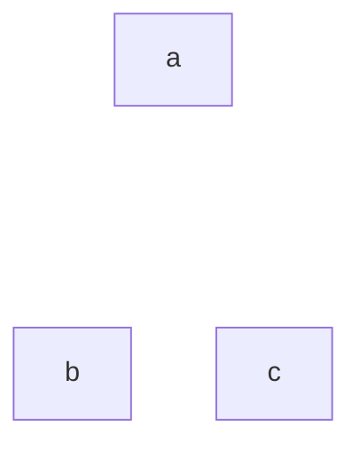

```ts
z(['a', 'b', 'c'])
```

</td>
<td>

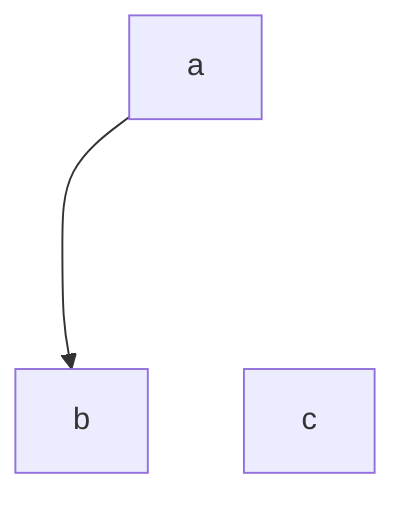

```ts
z('a', 'b')
```

</td>
<td>

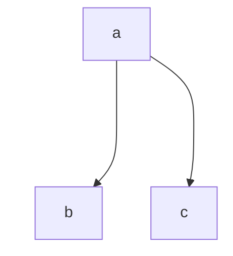

```ts
z('a', ['b', 'c'])
```

</td>
<td>

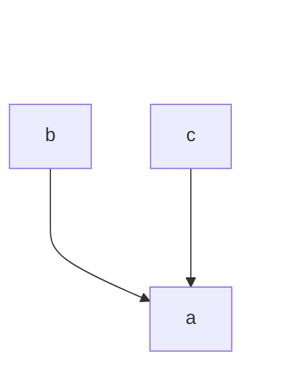

```ts
z(['b', 'c'], 'a')
```

</td>
<td>

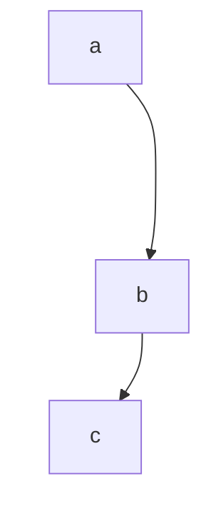

```ts
z('a', 'b', 'c')
```

</td>
<td>

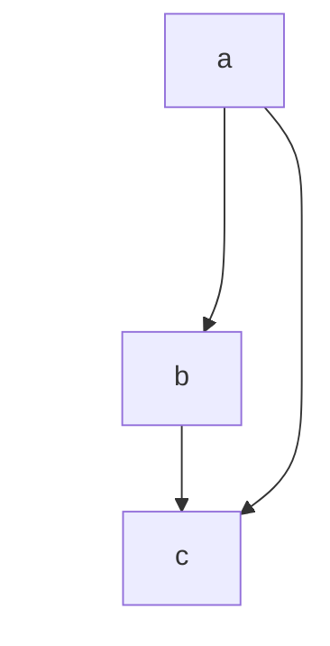

```ts
z('a', 'b', 'c'), z('a', 'c')
```

</td>
</tr>
</table>

### Four Nodes

The catalogue of four-vertex DAGs (31 shapes) maps onto builds combining chains, fans, diamonds, ladders, and merged roots.
Examples include diamond `a->b, a->c, b->d, c->d`, balanced forks `a->[b,c,d]`,
reversed sibling order `a->[d,c,b]`, cross-braced ladders `a->b, a->c, b->c, c->d`,
parallel roots with tails, and dual roots merging before a sink.
Uniform gaps persist regardless of edge density, demonstrating deterministic spacing across all enumerated isomorphism classes.

<table>
<tr><th>6 edges</th></tr>
<tr valign="bottom"><td>

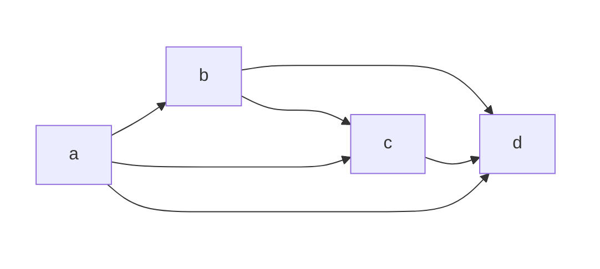

```ts
z('a', ['b', 'c', 'd']), z(['b', 'c'], 'd'), z('b', 'c')
```

</td></tr>

<tr><th>5 edges</th></tr>
<tr valign="bottom">
<td>

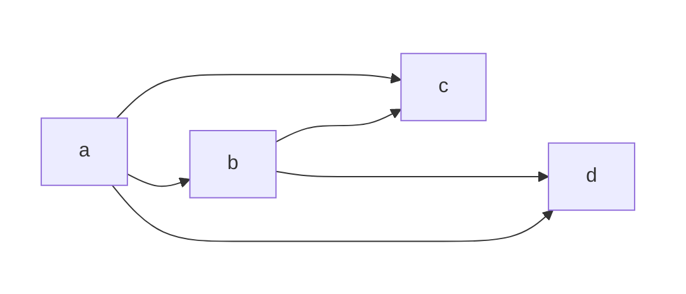

```ts
z('a', ['b', 'c', 'd']), z('b', ['c', 'd'])
```

</td>
<td>

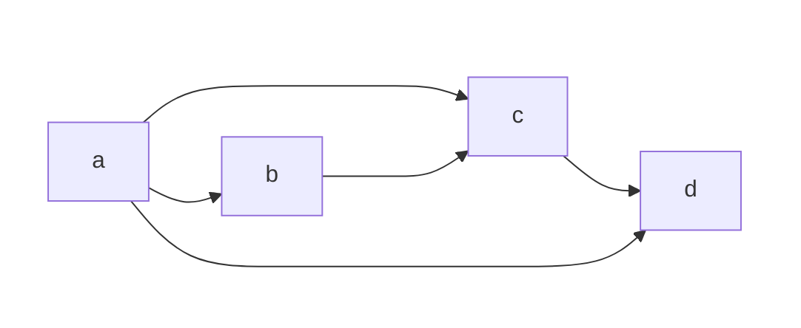

```ts
z('a', ['b', 'c', 'd']), z('b', 'c', 'd')
```

</td>
<td>

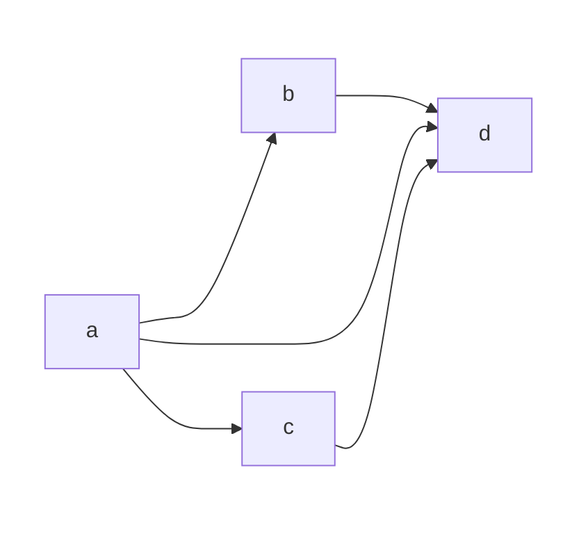

```ts
z('a', ['b', 'c', 'd']), z(['b', 'c'], 'd')
```

</td>
<td>

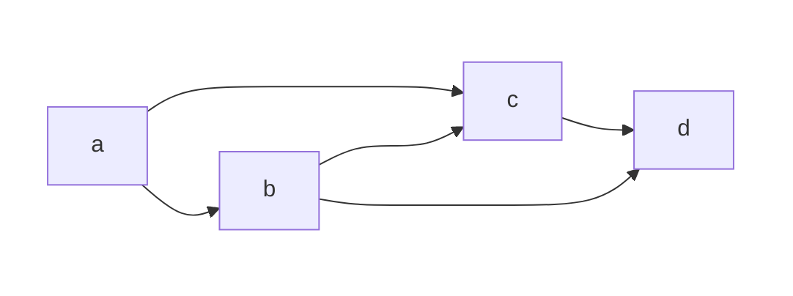

```ts
z('a', ['b', 'c']), z('b', ['c', 'd']), z('c', 'd')
```

</td>
<td>

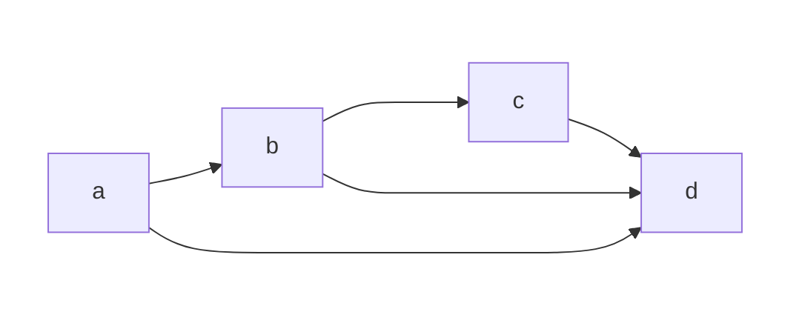

```ts
z('a', ['b', 'd']), z('b', ['c', 'd']), z('c', 'd')
```

</td>
<td>

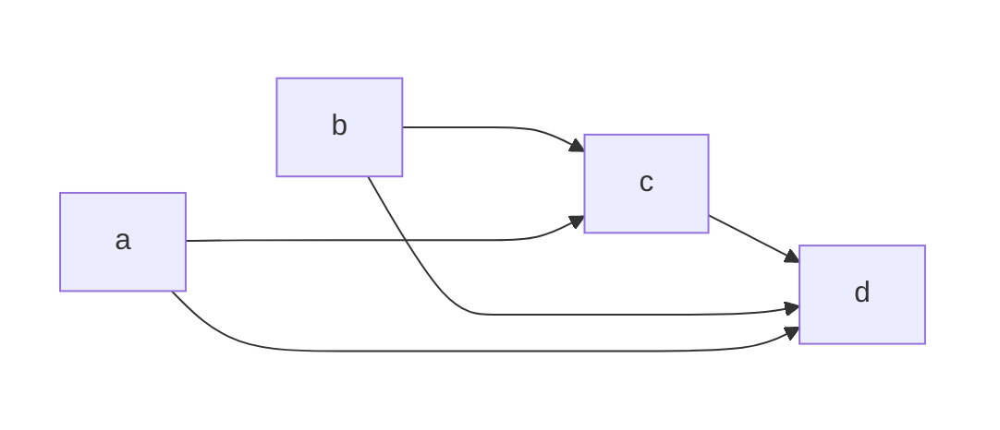

```ts
z('a', ['c', 'd']), z('b', ['c', 'd']), z('c', 'd')
```

</td>
</tr>

<tr><th>4 edges</th></tr>
<tr valign="bottom">
<td>

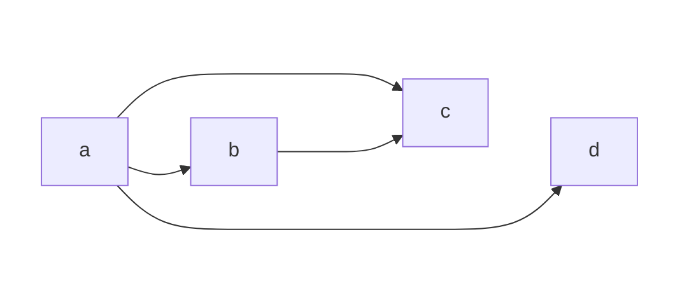

```ts
z('a', ['b', 'c', 'd']), z('b', 'c')
```

</td>
<td>

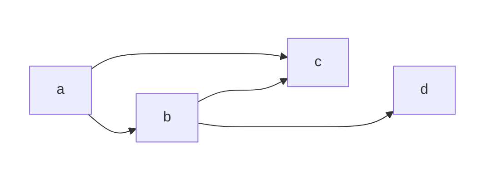

```ts
z('a', ['b', 'c']), z('b', ['c', 'd'])
```

</td>
<td>

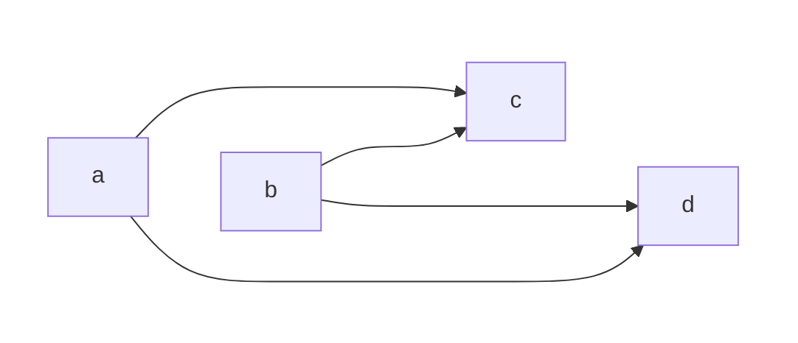

```ts
z('a', ['c', 'd']), z('b', ['c', 'd'])
```

</td>
<td>

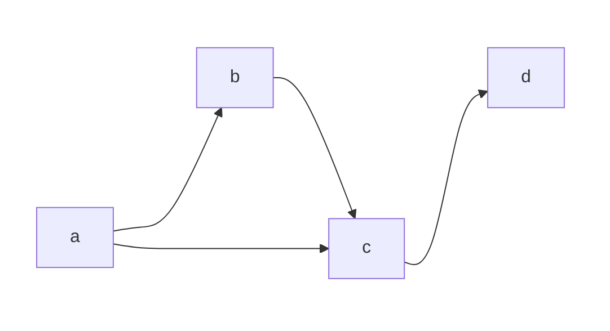

```ts
z('a', ['b', 'c']), z('b', 'c', 'd')
```

</td>
<td>

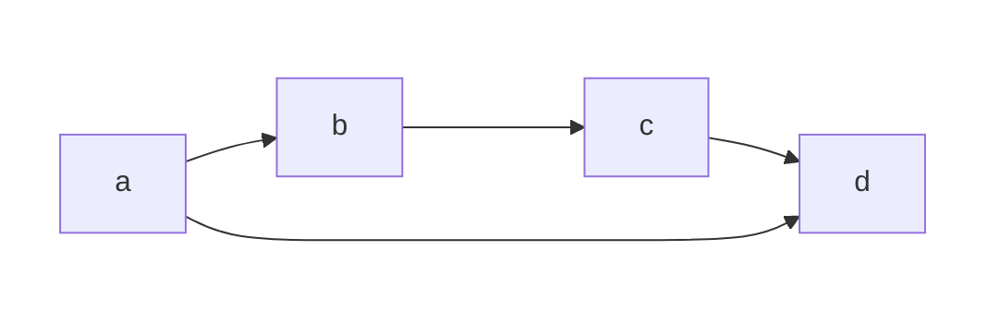

```ts
z('a', ['b', 'd']), z('b', 'c', 'd')
```

</td>
<td>

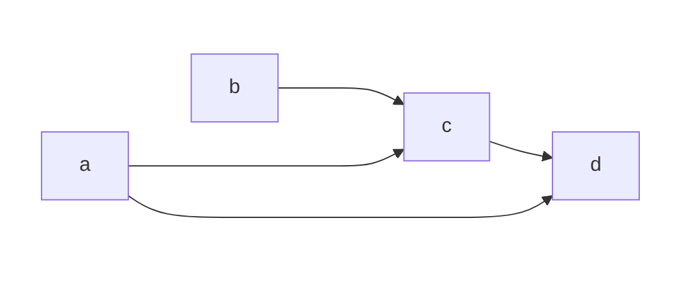

```ts
z('a', ['c', 'd']), z('b', 'c', 'd')
```

</td>
<td>

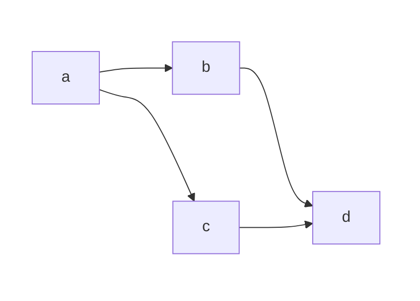

```ts
z('a', ['b', 'c']), z(['b', 'c'], 'd')
```

</td>
<td>

```mermaid
flowchart LR
    subgraph x[" "]
        direction TB
        a
        b
    end
    subgraph y[" "]
        direction TB
        c
        d
    end
    a ~~~ b
    style x fill:none,stroke:none
    style y fill:none,stroke:none
    a --> c
    a --> d
    b --> d
    c --> d

```

```ts
z('a', ['c', 'd']), z(['b', 'c'], 'd')
```

</td>
<td>

```mermaid
flowchart LR
    subgraph x[" "]
        direction TB
        a
        b
    end
    subgraph y[" "]
        direction TB
        c
        d
    end
    a ~~~ b
    c ~~~ d
    style x fill:none,stroke:none
    style y fill:none,stroke:none
    a --> b
    b --> c
    b --> d

```

```ts
z('a', 'b', 'c'), z(['b', 'c'], 'd')
```

</td>
</tr>

<tr><th>3 edges</th></tr>
<tr valign="bottom">
<td>

```mermaid
flowchart LR
    subgraph x[" "]
        direction TB
        a
        c
    end
    subgraph y[" "]
        direction TB
        b
        d
    end
    a ~~~ b
    c ~~~ d
    style x fill:none,stroke:none
    style y fill:none,stroke:none
    a --> b
    a --> c
    a --> d

```

```ts
z('a', ['b', 'c', 'd'])
```

</td>
<td>

```mermaid
flowchart LR
    subgraph x[" "]
        direction TB
        a
        b
    end
    subgraph y[" "]
        direction TB
        c
        d
    end
    a ~~~ b
    c ~~~ d
    style x fill:none,stroke:none
    style y fill:none,stroke:none
    a --> b
    a --> c
    b --> c

```

```ts
z('a', ['b', 'c']), z('b', 'c')
```

</td>
<td>

```mermaid
flowchart LR
    subgraph x[" "]
        direction TB
        a
        b
    end
    subgraph y[" "]
        direction TB
        c
        d
    end
    a ~~~ b
    c ~~~ d
    style x fill:none,stroke:none
    style y fill:none,stroke:none
    a --> c
    a --> d
    b --> c

```

```ts
z('a', ['c', 'd']), z('b', 'c')
```

</td>
<td>

```mermaid
flowchart LR
    subgraph x[" "]
        direction TB
        a
        b
    end
    subgraph y[" "]
        direction TB
        c
        d
    end
    a ~~~ b
    c ~~~ d
    style x fill:none,stroke:none
    style y fill:none,stroke:none
    a --> b
    b --> c
    b --> d

```

```ts
z('a', 'b'), z('b', ['c', 'd'])
```

</td>
<td>

```mermaid
flowchart LR
    subgraph x[" "]
        direction TB
        a
        b
    end
    subgraph y[" "]
        direction TB
        c
        d
    end
    a ~~~ b
    c ~~~ d
    style x fill:none,stroke:none
    style y fill:none,stroke:none
    a --> b
    b --> c
    c --> d

```

```ts
z('a', 'b', 'c', 'd')
```

</td>
<td>

```mermaid
flowchart LR
    subgraph x[" "]
        direction TB
        a
        c
    end
    subgraph y[" "]
        direction TB
        b
        d
    end
    a ~~~ b
    c ~~~ d
    style x fill:none,stroke:none
    style y fill:none,stroke:none
    a --> c
    b --> c
    c --> d

```

```ts
z(['a', 'b'], 'c'), z('c', 'd')
```

</td>
<td>

```mermaid
flowchart LR
    subgraph x[" "]
        direction TB
        a
        b
    end
    subgraph y[" "]
        direction TB
        c
        d
    end
    a ~~~ b
    c ~~~ d
    style x fill:none,stroke:none
    style y fill:none,stroke:none
    a --> d
    b --> c
    c --> d

```

```ts
z('a', 'd'), z('b', 'c', 'd')
```

</td>
<td>

```mermaid
flowchart LR
    subgraph x[" "]
        direction TB
        a
        c
    end
    subgraph y[" "]
        direction TB
        b
        d
    end
    a ~~~ b
    c ~~~ d
    style x fill:none,stroke:none
    style y fill:none,stroke:none
    a --> d
    b --> d
    c --> d

```

```ts
z(['a', 'b', 'c'], 'd')
```

</td>
</tr>

<tr><th>2 edges</th></tr>
<tr valign="bottom">
<td>

```mermaid
flowchart LR
    subgraph x[" "]
        direction TB
        a
        b
    end
    subgraph y[" "]
        direction TB
        c
        d
    end
    a ~~~ b
    c ~~~ d
    style x fill:none,stroke:none
    style y fill:none,stroke:none
    a --> b
    b --> c

```

```ts
z('a', ['b', 'c'])
```

</td>
<td>

```mermaid
flowchart LR
    subgraph x[" "]
        direction TB
        a
        c
    end
    subgraph y[" "]
        direction TB
        b
        d
    end
    a ~~~ b
    c ~~~ d
    style x fill:none,stroke:none
    style y fill:none,stroke:none
    a --> b
    a --> c

```

```ts
z('a', 'b', 'c')
```

</td>
<td>

```mermaid
flowchart LR
    subgraph x[" "]
        direction TB
        a
        b
    end
    subgraph y[" "]
        direction TB
        c
        d
    end
    a ~~~ b
    c ~~~ d
    style x fill:none,stroke:none
    style y fill:none,stroke:none
    a --> c
    b --> c
```

```ts
z(['a', 'b'], 'c')
```

</td>
<td>

```mermaid
flowchart LR
    subgraph x[" "]
        direction TB
        a
        b
    end
    subgraph y[" "]
        direction TB
        c
        d
    end
    a ~~~ b
    c ~~~ d
    style x fill:none,stroke:none
    style y fill:none,stroke:none
    a --> d
    b --> c

```

```ts
z('a', 'd'), z('b', 'c')
```

</td>
</tr>

<tr><th>1 edge</th></tr>
<tr><td>

```mermaid
flowchart LR
    subgraph x[" "]
        direction TB
        a
        c
    end
    subgraph y[" "]
        direction TB
        b
        d
    end
    a ~~~ b
    c ~~~ d
    style x fill:none,stroke:none
    style y fill:none,stroke:none
    a --> b

```

```ts
z('a', 'b')
```

</td></tr>

<tr><th>0 edge</th></tr>
<tr><td>

```mermaid
flowchart LR
    subgraph x[" "]
        direction TB
        a
        c
    end
    subgraph y[" "]
        direction TB
        b
        d
    end
    a ~~~ b
    c ~~~ d
    style x fill:none,stroke:none
    style y fill:none,stroke:none
```

```ts
z(['a', 'b', 'c', 'd'])
```

</td></tr>
</table>

### Five Nodes

Five-vertex coverage extends chains, wide fans, multi-source funnels, diamonds with tails, interleaved ladders,
balanced two-level trees, partial fans with extended child, mid-node splits, and zigzags with cross-links.
Each construction confirms sorted order, equal stride between consecutive nodes in the topological sequence, and stable root-to-leaf monotonicity even as edges multiply.
The tests validate that every key participates in the final ordering and that no hidden permutations violate declared constraints.

<table>
<tr><th>chain</th><th>wide fan</th><th>funnel</th><th>diamond tail</th></tr>
<tr valign="bottom">
<td>

```mermaid
flowchart LR
    g[" "]
    g ~~~ a
    g ~~~ b
    g ~~~ c
    g ~~~ d
    g ~~~ e
    a --> b --> c --> d --> e
    style g fill:none,stroke:none,color:none
```

```ts
z('a', 'b', 'c', 'd', 'e')
```

</td>
<td>

```mermaid
flowchart LR
    g[" "]
    g ~~~ a
    g ~~~ b
    g ~~~ c
    g ~~~ d
    g ~~~ e
    a --> b
    a --> c
    a --> d
    a --> e
    style g fill:none,stroke:none,color:none
```

```ts
z('a', ['b', 'c', 'd', 'e'])
```

</td>
<td>

```mermaid
flowchart LR
    g[" "]
    g ~~~ a
    g ~~~ b
    g ~~~ c
    g ~~~ d
    g ~~~ e
    a --> e
    b --> e
    c --> e
    d --> e
    style g fill:none,stroke:none,color:none
```

```ts
z(['a', 'b', 'c', 'd'], 'e')
```

</td>
<td>

```mermaid
flowchart LR
    g[" "]
    g ~~~ a
    g ~~~ b
    g ~~~ c
    g ~~~ d
    g ~~~ e
    a --> b
    a --> c
    b --> d
    c --> d
    d --> e
    style g fill:none,stroke:none,color:none
```

```ts
z('a', 'b', 'c', 'd', 'e'), z('a', 'c', 'd')
```

</td>
</tr>

<tr><th>interleaved ladders</th><th>balanced two-level</th><th>fan with deep child</th><th>zigzag cross</th></tr>
<tr valign="bottom">
<td>

```mermaid
flowchart LR
    g[" "]
    g ~~~ a
    g ~~~ b
    g ~~~ c
    g ~~~ d
    g ~~~ e
    a --> b
    b --> e
    a --> c
    c --> d
    d --> e
    style g fill:none,stroke:none,color:none
```

```ts
z('a', 'b', 'e'), z('a', 'c', 'd', 'e')
```

</td>
<td>

```mermaid
flowchart LR
    g[" "]
    g ~~~ a
    g ~~~ b
    g ~~~ c
    g ~~~ d
    g ~~~ e
    a --> b
    a --> c
    b --> d
    c --> e
    style g fill:none,stroke:none,color:none
```

```ts
z('a', ['b', 'c']), z('b', 'd'), z('c', 'e')
```

</td>
<td>

```mermaid
flowchart LR
    g[" "]
    g ~~~ a
    g ~~~ b
    g ~~~ c
    g ~~~ d
    g ~~~ e
    a --> b
    a --> c
    a --> d
    d --> e
    style g fill:none,stroke:none,color:none
```

```ts
z('a', ['b', 'c', 'd']), z('d', 'e')
```

</td>
<td>

```mermaid
flowchart LR
    g[" "]
    g ~~~ a
    g ~~~ b
    g ~~~ c
    g ~~~ d
    g ~~~ e
    a --> b
    b --> c
    a --> d
    d --> e
    c --> e
    style g fill:none,stroke:none,color:none
```

```ts
z('a', ['b', 'd']), z('b', 'e'), z('b', 'c', 'd')
```

</td>
</tr>
</table>

## Extensions

### Extension Stability

First builds are reproducible: identical inputs yield identical ranks.
Extending with additional relations preserves all seeded values while inserting newcomers at midpoints between valid bounds (`d = mid(a+1, b-1)`).
Multiple extensions chained in different regions keep earlier inserts fixed, showing that rank assignment uses seeds as immutable fences.
When nested tree shorthand seeds wide gaps, subsequent inserts between siblings respect original positions and narrow gaps symmetrically.

### Extension Density

Iterative midpoint insertions demonstrate gap shrinkage.
Starting from `a<b`, successive overrides insert `c`, then `d`, then `e`, then `f`, each halving or quartering the remaining interval.
Earlier inserts remain unchanged (`c` stays at the first midpoint) while new points land strictly inside ever smaller windows.
Inserts can target both sides of a midpoint or only the right side; ordering remains intact and seeds never drift.

### Extension Packing

Extensions also work outside the initial segment: placing nodes below the lowest seed or above the highest seed uses mirrored midpoint selection with the same stride size.
Dense clusters near a large gap center keep seeds stable.
Mixing outer inserts with inner midpoints leaves fences intact while layering additional midpoints (`f`) between `a` and `c`.
Packed sibling gaps across multiple regions (`left, mid, edge, right`) show that each local interval can be subdivided independently across successive overrides, with later splits smaller than half the prior stride.
Cycles throw an exception immediately, ensuring the DAG assumption holds even in extension calls.

## Appendix

### Design Notes

Implementation relies on Kahn topological sorting over all declared pairs plus seeded extras, followed by forward and backward constraint propagation to derive lower and upper fences.
Midpoint assignment favors symmetric spacing; a constant STEP of 1024 defines initial gaps, then bitwise shifts (`>>1`) halve intervals during insertion cascades.
Fence detection uses binary search to locate neighboring seeds and clamp candidates, keeping determinism across runs.

### Contributing

Contributions should mirror the existing Vitest suites: pair basics, recursion, inference, topology (three through five nodes), extension stability, density, and packing.
Each scenario should validate ordering, stride constancy, and seed preservation without relying on external fixtures.

### License

MIT
